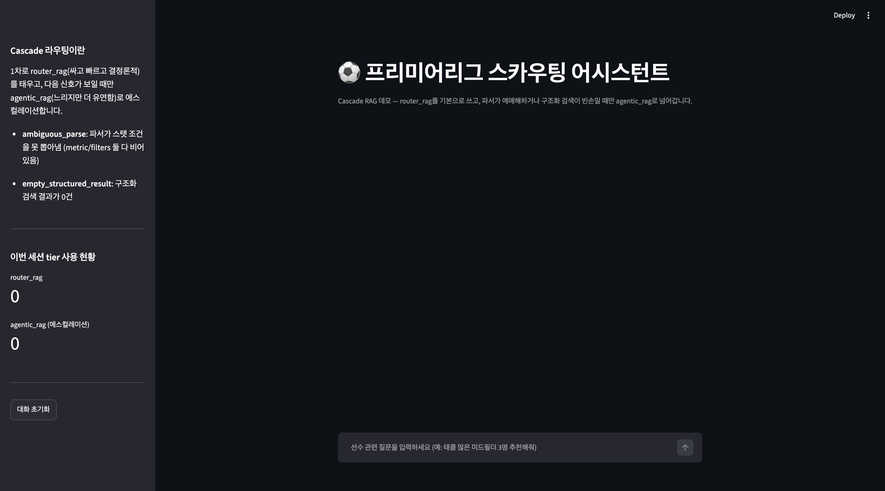
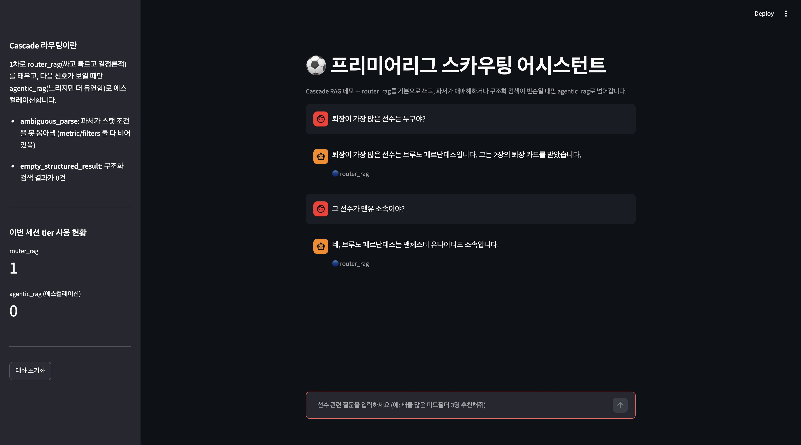

# footballer-scouting-agent

프리미어리그 2024-25 시즌 선수 스탯 데이터를 자연어로 질의하는 스카우팅 어시스턴트.
같은 데이터·같은 질문셋으로 **naive RAG → router RAG → agentic RAG** 세 가지 아키텍처를
직접 구현하고 정량 비교한 프로젝트입니다.

> "인터셉트가 가장 많은 미드필더는?" 같은 argmax/필터 질문에서 순수 벡터 검색(RAG)이
> 왜, 얼마나 실패하는지 확인하고, 이를 해결하는 두 가지 다른 접근(고정 라우팅 vs
> 자율 에이전트)을 구현해 비교했습니다.

## 핵심 결과

세 파이프라인을 같은 골든셋(69문항 + refusal 10문항)으로 평가했습니다.

| 지표 | naive (bge-m3) | naive (openai) | router (전체 파이프라인) | agentic (전체 파이프라인) |
|---|---|---|---|---|
| Answer Hit Rate | 7.25%* | 0%* | **98.55%** | 98.55% |
| MRR | 0.0362 | 0.0000 | 1.0000 | 0.9710 |
| Context Precision | 0.0145 | 0.0000 | 0.9662 | 0.9203 |
| Context Recall | 0.0242 | 0.0000 | 0.9662 | 0.9179 |
| Faithfulness (숫자 근거성) | — | — | 98.37% | 88.68% |

\* naive는 retrieval Hit Rate@5 기준 (최종 답변 생성 단계까지 못 감)
router 지표는 2026-07-06 측정, agentic·faithfulness는 2026-07-16 재측정 기준입니다.

**결론:** 순수 벡터 검색(naive RAG)은 argmax/필터형 질문에서 사실상 못 씁니다(7% 이하).
질문을 구조화된 스펙으로 변환해 pandas로 정확히 필터링하는 router RAG와, LangGraph
ReAct 에이전트가 스스로 도구를 선택하는 agentic RAG는 둘 다 실사용 가능한 수준(Hit Rate
98%대)입니다. Faithfulness(답변 숫자가 실제 데이터 근거인지)는 router가 98.37%로 agentic
(88.68%)보다 뚜렷이 높아, 이번 골든셋 기준으로는 router RAG가 1순위 권장(정확도 +
결정론적 재현성 + 근거성). 세부 비교, 발견한 버그, 남은 이슈는
**[RAG_COMPARISON_REPORT.md](RAG_COMPARISON_REPORT.md)**에 정리했습니다.

router RAG를 기본으로 쓰되, 그 한계(파서가 애매하게 파싱하거나 구조화 검색이 빈손인 경우)를
agentic RAG로 보완하는 **cascade RAG**(`agents/cascade_rag.py`)를 추가로 구현했습니다. "싸고
빠른 경로를 기본으로 쓰고, 불확실할 때만 비싼 경로로 에스컬레이션한다"는 cascade 라우팅
패턴으로, 세 파이프라인의 실측 실패 지점을 그대로 에스컬레이션 트리거로 재사용합니다
(정량 평가는 아직 골든셋 기준으로 진행 전 — 데모/프로토타입 레이어입니다).

## 아키텍처

```
naive_rag    질문 임베딩 → 벡터 유사도 검색만
             └─ 한계: "가장 많은/높은 X" 질문은 텍스트 유사도로 못 풂

router_rag   질문 → LLM이 구조화 스펙(포지션/지표/정렬/필터)으로 변환
             → is_stat_query 여부로 pandas 필터링 or 벡터 검색 라우팅
             → 후속 질문("그 중에서 ~")은 이전 후보 carryover로 처리

agentic_rag  고정 라우팅 없음 — LangGraph ReAct 에이전트가 매 턴 스스로
             stat_query / vector_search / player_lookup 중 어떤 툴을,
             몇 번, 어떤 인자로 호출할지 판단

cascade_rag  router_rag를 1차로 사용 — 파서가 애매하게 파싱했거나(ambiguous_parse)
             구조화 검색이 빈손이면(empty_structured_result) agentic_rag로 에스컬레이션
```

## 프로젝트 구조

```
agents/
  naive_rag.py        벡터 검색만 하는 베이스라인
  router_rag.py        구조화 쿼리 파서 + pandas 필터링 + 벡터 검색 라우팅
  agentic_rag.py       LangGraph ReAct 에이전트 (stat_query/vector_search/player_lookup)
  cascade_rag.py        router_rag 1차 + 저신뢰 신호 시 agentic_rag 에스컬레이션
tools/
  data_processor.py    원본 CSV → RAG용 청크/정제 데이터 생성
  embedder.py           BGE-M3 / OpenAI 임베딩 생성 + FAISS 인덱싱
  retriever.py          FAISS 벡터 검색
  structured_query.py   자연어 질문 → 구조화 스펙 변환 (LLM function-calling)
  agentic_tools.py      agentic_rag용 LangChain 툴 정의
  scouting_report.py    선수 스카우팅 리포트 이미지 카드 생성
evaluate/
  evaluate_rag.py            naive RAG 평가 (bge-m3 vs openai 임베딩)
  evaluate_router.py         router_rag 파서 단위 평가
  evaluate_router_full.py    router_rag 전체 파이프라인 평가 (Answer Hit Rate, Faithfulness)
  evaluate_agentic.py        agentic_rag 전체 파이프라인 평가 (Hit Rate/MRR/Precision/Recall/Faithfulness)
  evaluate_refusal.py        데이터에 없는 질문 거절 처리 평가
  evaluate_robustness.py     골든셋 표현 변형(반말/오타/어순) 강건성 평가
data/
  golden_set.json       평가용 질문셋 (single/complex/followup/refusal)
  robustness_set.json   강건성 평가용 변형 질문셋
  processed/             정제된 선수 데이터 (CSV/JSON 청크)
  index/                  FAISS 벡터 인덱스
create_golden_set.py    골든셋 생성 스크립트 (pandas 필터/정렬 로직 기반 정답 산출)
demo_cascade.py          cascade RAG Streamlit 채팅 데모 (tier/에스컬레이션 사유 표시)
RAG_COMPARISON_REPORT.md  3자 비교 최종 리포트
```

## 데이터

- `data/epl_player_stats_24_25.csv` — 프리미어리그 2024-25 시즌 선수 스탯
  (출처: [Kaggle - English Premier League Player Stats 24/25](https://www.kaggle.com/datasets/aesika/english-premier-league-player-stats-2425))
- 좌표/이벤트 로그 데이터는 없어 실제 히트맵 대신, 스카우팅 리포트는 포지션 동료 대비
  퍼센타일 랭킹으로 대체 표현 (`tools/scouting_report.py`)

## 셋업

Python 3.11 권장(pandas/faiss-cpu/sentence-transformers가 최신 Python 버전에서는 사전빌드
패키지를 못 찾아 설치가 실패할 수 있음).

```bash
python3.11 -m venv .venv
source .venv/bin/activate
pip install -r requirements.txt
```

`.env` 파일에 아래 값 필요:
```
OPENAI_API_KEY=...
```

## 사용법

CLI로 바로 실행:
```bash
python main.py
```
대화형으로 질문하면 router_rag가 답변하고, 필터/정렬로 선수가 특정되면 스카우팅
리포트 이미지 생성도 제안합니다.

코드에서 직접 쓸 때:
```python
from tools.embedder import BGEEmbedder
from tools.retriever import FAISSRetriever
from agents.router_rag import RouterRAG

vector_retriever = FAISSRetriever(embedder=BGEEmbedder())
vector_retriever.build()  # data/index/에 이미 인덱스가 있으면 로드만 함

rag = RouterRAG(vector_retriever=vector_retriever)
result = rag.query("인터셉트가 가장 많은 미드필더는?")
print(result)
```

Streamlit 데모(cascade RAG, tier/에스컬레이션 표시):
```bash
streamlit run demo_cascade.py
```




각 답변 아래 배지로 어느 tier(🔵 router_rag / 🟠 agentic_rag 에스컬레이션)가 답했는지 보여줍니다.

## 평가 재현

프로젝트 루트에서 모듈 형태로 실행해야 `tools`/`agents` 패키지를 정상적으로 찾습니다
(`python evaluate/evaluate_rag.py`처럼 파일 경로로 직접 실행하면 `ModuleNotFoundError` 발생):
```bash
python -m evaluate.evaluate_rag           # naive RAG
python -m evaluate.evaluate_router_full   # router RAG 전체 파이프라인
python -m evaluate.evaluate_agentic       # agentic RAG 전체 파이프라인
python -m evaluate.evaluate_refusal       # refusal 처리
python -m evaluate.evaluate_robustness    # 강건성
```

결과는 `output/*.json`에 집계 지표로 저장됩니다 (골든셋 문항/정답이 그대로 노출되는
상세 로그는 `.gitignore`로 제외).

## 기술 스택

Python · LangChain / LangGraph · OpenAI API · FAISS · BGE-M3 (sentence-transformers) ·
pandas · scikit-learn
